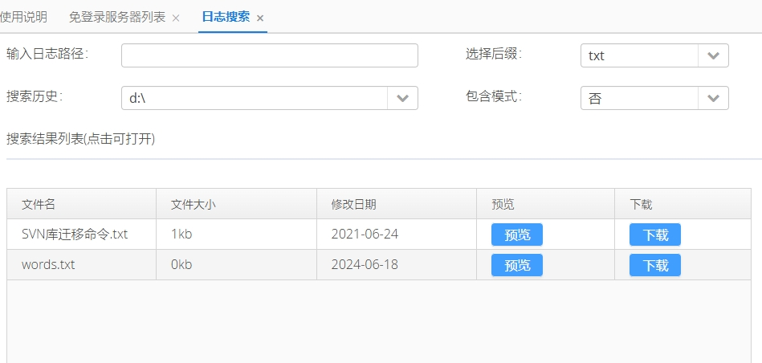
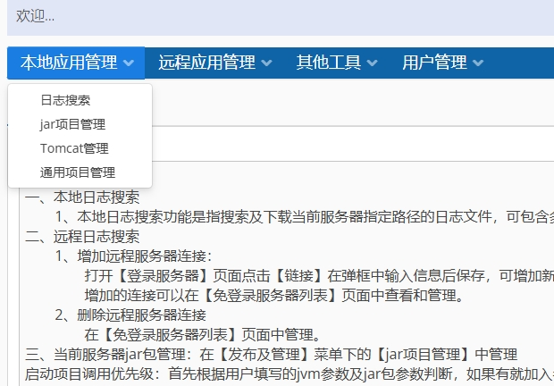
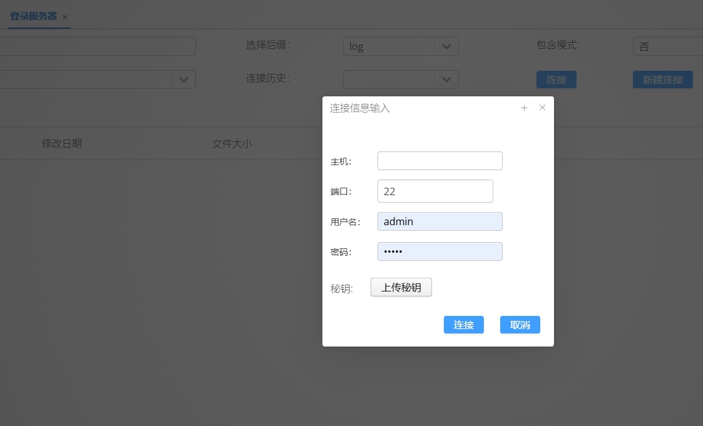
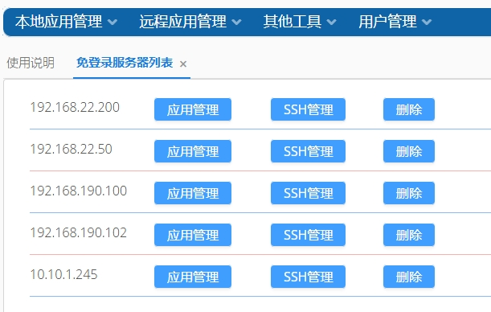
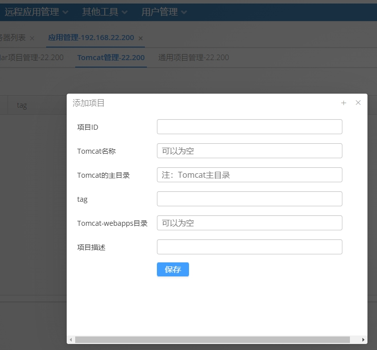

logvewer 介绍
==============

logviewer 是一个可以方便开发人员通过浏览器查看和下载远程服务器集群日志或指定文件的应用，同时可以管理jar包和tomcat

解决的问题
==============
- 针对服务器比较少的情况下，运维人员无需搭建日志推送或处理程序，使用该应用部署到任意一台服务器即可通过浏览器访问和下载所有服务器的授权日志或其他文件
- 需要查看日志的Linux的登录用户名和密码不需要提供给开发人员，只需要通过页面添加好机器即可，减少登录操作风险；
- 此外增加了jar包管理、tomcat管理、通用项目管理等功能。

使用步骤：
========

- 1.将war包复制到任意一台服务器某个路径下（新建一个空的目录）
- 2.启动即可访问：ip:9095/
- 3.使用spring-boot内嵌Tomcat启动,启动命令nohup java -jarr logviewer.jar &
- 4.默认登录admin/admin,登录后可自行修改
- 5.注意 ** 不兼容centos 6.x版本，开发环境是centos7.9

配置
========
-  远程连接提供连接方式：页面直接输入服务器用户名、密码端口等信息
-  建议使用管理员预先配置的方式，这样可以避免其他用户直接登录服务器操作
-  在resources 下面application.properties中可以配置应用访问路径和启动端口
- fileSuffix.conf 用来配置可以查看和搜索的文件后缀(支持包含后缀模式，方便查看滚动的日志)
- 其他应用使用中的数据会保存在war包同级目录下(用户使用产生的数据会在当前目录下创建用户.properties文件进行记录)

修改配置的方法
========
- 1.使用源码修改后打包；
- 2.使用压缩软件打开直接修改后保存，简单方便；

## 截图

 
 
 
 
 

- 我的博客地址：https://blog.csdn.net/sl4379

## 后续计划
- 制作一个安全管理页面，功能包括列出当前使用的端口的状态、策略、允许IP、备注。
- 添加端口配置，包括协议、策略、端口、来源、备注。
- 制作IP规则，限制可访问的IP
- 